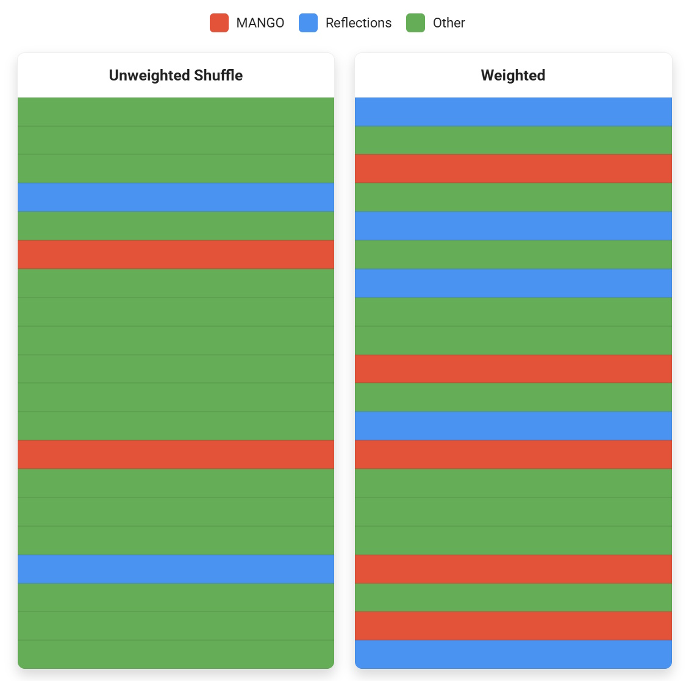

<h1 align="center">
  Qilletni
</h1>

  <b>
    <a href="https://qilletni.dev/">Website</a> •
    <a href="https://docs.qilletni.dev/">Package Docs</a> •
    <a href="https://api.qilletni.dev/">Native API Docs</a>
  </b>

  <i>
    A high-performance DSL for curating music queues and playlists - declarative, composable, and music service-agnostic.
  </i>

---

## Overview

Qilletni is a Domain-Specific Language designed to orchestrate and manipulate music queues, playlists, and metadata across multiple streaming platforms.

Where most music platform APIs are either vastly different from one another or require a learning curve, Qilletni abstracts platform-dependent logic and lets you focus on actual algorithms and orchestration.
Qilletni treats music concepts as native constructructs, including featuring smart conversion across service providers' types.
Extension of the language is easy with a package system and native functions that seamlessly invoke Java methods. Qilletni is a statically typed and object-oriented with a familiar C-style syntax that leverages composition over inheritance.

See the [Getting Started page](https://qilletni.dev/quickstart/getting_started/) in the docs to start using Qilletni.

## Key Features

### Music as a First-Class Citizen

[Native types](https://qilletni.dev/language/types/built_in_types/) feature `song`, `collection`, `album`, and `weights`, all of which can be converted between service providers seamlessly.
The `play` keyword can put songs in your account's queue, add it to a list, or invoke a callback.
Example:

### Weighted Playlists

Playlists may be played as a whole, but may be weighted which changes the distribution of songs, or adds in custom logic for song selection.

Below is an example of playing 20 songs from a playlist `"My Songs"` which is 10 songs, with weights applied.

The played songs with and without weights applied:

<picture>
  <source media="(prefers-color-scheme: dark)" srcset="images/shuffle_dark.jpg">
  <source media="(prefers-color-scheme: light)" srcset="images/shuffle_light.jpg">
  
</picture>

For a more detailed look at this specific example, with more visualizations, see the [weights documentation](https://qilletni.dev/language/types/built_in_types/#weights).

And a more exhaustive example of what weights can do:

### Multi-Platform Support
Current supported platforms are [Spotify](https://qilletni.dev/official_packages/service_providers/spotify/), [Tidal](https://qilletni.dev/official_packages/service_providers/tidal/), and [Last.fm](https://qilletni.dev/official_packages/service_providers/lastfm/). These are provided by external packages called _[service providers](https://qilletni.dev/language/service_providers/)_, and are not baked into the language.

Service providers can also convert native types across platforms seamlessly.

### Familiar Syntax

Qilletni features C-style syntax, with basic objects represented as [Entities](https://qilletni.dev/language/types/entities/).
The following is a simple example featuring Qilletni's syntax.

### Package Management

Qilletni has full support for publishable packages with the Qilletni Package Manager (QPM). The [backend](https://github.com/Qilletni/qpm-backend) is hosted via Cloudflare Workers, and uses GitHub for authentication.

For information on package management, see the [package management docs](https://qilletni.dev/packages/package_management/).

Official Qilletni packages are documented via the custom documentation generator. To view docs of these packages such as **postgres**, **http**, or **json**, see [https://docs.qilletni.dev/](https://docs.qilletni.dev/).
