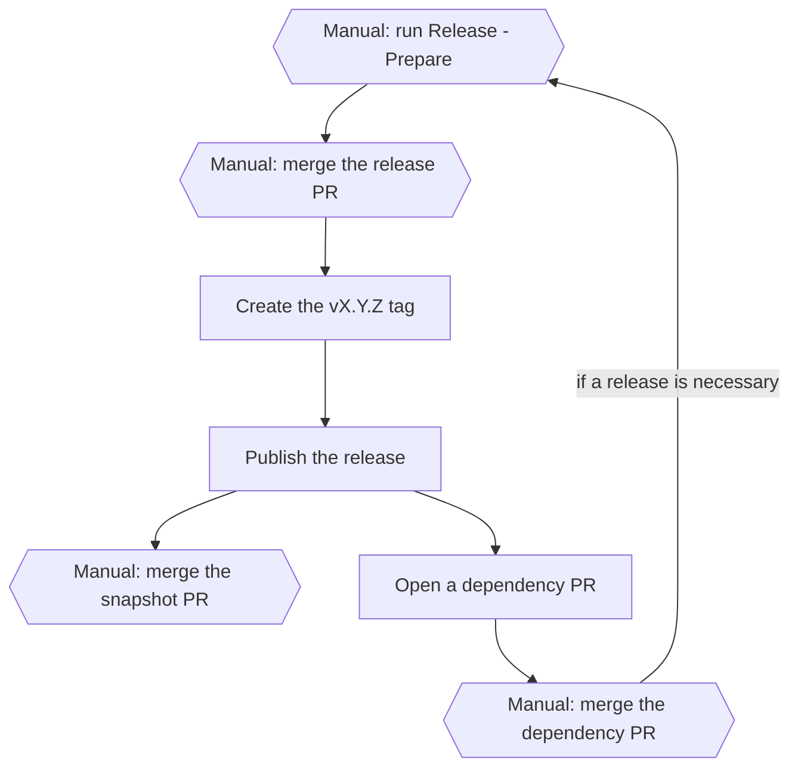
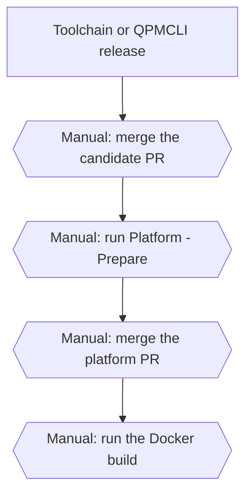

# Qilletni Release Protocol

This document gives the procedure to release a Qilletni component. It also shows how the
release moves to the repositories that use it. It is the main release document for all five producer
repositories. The other repositories keep a short `RELEASE.md` with only their own facts.

## Overview



- A hexagon with "Manual:" is a step that the maintainer does.
- A rectangle is a step that a workflow does.

A component release has these steps. The maintainer does the steps that show **(manual)**.

1. Write the changelog, and a migration guide for a major bump. **(manual)**
2. Run the `Release - Prepare` workflow. **(manual)**
3. Merge the release PR. **(manual)**
4. The workflow creates the tag and publishes the release.
5. Merge the snapshot PR. **(manual)**
6. The workflow opens a dependency PR in each consumer repository.
7. Merge each dependency PR, then decide if that repository needs a release. **(manual)**

A platform release and a library package release are separate processes. Refer to
[Release the platform](#release-the-platform) and
[Publish a library package](#publish-a-library-package).

## Producer repositories

| Repository | Component | Kind | Version key | Publishes to | Consumes | Sends a platform candidate |
| --- | --- | --- | --- | --- | --- | --- |
| Qilletni | `qilletni-core` | `maven` | `qilletniVersion` | Maven Central | — | No |
| QilletniPackageUtility | `qilletni-pkgutil` | `maven` | `pkgutilVersion` | Maven Central | — | No |
| QilletniDocgen | `qilletni-docgen` | `maven` | `qilletniDocgenVersion` | Maven Central | `qilletni-core` | No |
| QilletniToolchain | `qilletni-toolchain` | `cli` | `toolchainVersion` | GitHub release | `qilletni-core`, `qilletni-pkgutil`, `qilletni-docgen` | Yes |
| QPMCLI | `qpm` | `cli` | `qpmVersion` | GitHub release | `qilletni-core`, `qilletni-pkgutil` | Yes |

Each repository keeps its version key in `gradle.properties`. The consumer lists come from
`release/components.yml`.

Qilletni publishes two artifacts from one version, `qilletniVersion`:
`dev.qilletni.impl:qilletni` (core) and `dev.qilletni.api:qilletni-api` (API). They always
release together, as the one component `qilletni-core`.

## Prepare a release

1. Write the changes for this release in the `## [Unreleased]` section of `CHANGELOG.md`.
   **(manual)**
2. For a major bump, write the migration guide `docs/migrations/X.Y.Z.md`. Use the new
   version as the file name. **(manual)**
3. Run the `Release - Prepare` workflow on `master`. Select `patch`, `minor` or `major`.
   **(manual)**

<details>
    <summary>What does this do?</summary>

The workflow calls `reusable-release-prepare.yml` in this repository. It does these steps:

- It calculates the next version from the latest stable `vX.Y.Z` tag. It does not use the
  version file, because that file already has the next `-SNAPSHOT` version. For example,
  `1.0.2-SNAPSHOT` with a `patch` bump gives `1.0.2`, not `1.0.3`.
- It stops if the `## [Unreleased]` section is empty.
- It stops if the bump is `major` and `docs/migrations/X.Y.Z.md` does not exist.
- It runs `./gradlew clean test`, and stops if a test fails.
- It writes the new version to the version key.
- It moves the `Unreleased` entries to a new `## [X.Y.Z] - <date>` section.
- It writes the release marker `release/pending-release.json`. The marker records the
  component, the old version, the new version and the bump.
- It opens the release PR.

</details>

4. Examine the release PR. Make sure that the version and the changelog are correct.
   Then merge the release PR. **(manual)**

<details>
    <summary>Why is this safe?</summary>

- The workflow signs the release PR and adds the `release` label.
- No workflow merges the release PR. Only the maintainer can merge it.
- The workflow uses a GitHub App token that can only write to this one repository.

</details>

### Select the bump

The japicmp gate compares the public API with the last release. It uses the bump that the
maintainer selects.

| Bump | The japicmp gate stops the release if |
| --- | --- |
| `patch` | the public API has a change of any type |
| `minor` | the public API has an incompatible change |
| `major` | the public API has an incompatible change and `docs/migrations/X.Y.Z.md` does not exist |

Not all repositories use the japicmp gate. Refer to the `RELEASE.md` of each repository.

## Publish a release

When the maintainer merges the release PR, the workflow `Publish Release` starts. The
maintainer does not start it.

1. The `tag-release` job creates the `vX.Y.Z` tag on the merge commit.

<details>
    <summary>Why is this safe?</summary>

- The job runs for each push to `master`. If the version is a `-SNAPSHOT`, the job does
  not create a tag.
- If the version is not a `-SNAPSHOT`, the job requires the release marker
  `release/pending-release.json`. It makes sure that the marker agrees with the version.
- The job gets the merge commit's pull request from the GitHub API
  (`check-merge-provenance`). The pull request must be a merged release PR with the
  `release` label. A different pull request cannot start a release with a copy of the
  marker.
- If the tag already exists on this commit, the job does nothing.
- If the tag already exists on an earlier commit, the job treats the push as an ordinary
  commit. This occurs before the snapshot PR merges. A release tag never moves.

</details>

2. The `build-and-publish` job starts from the new tag. It publishes the release to Maven
   Central and creates the GitHub release.

<details>
    <summary>What does this do?</summary>

The job does these steps:

1. It makes sure that the tag agrees with the version, and that core and API have the same
   version.
2. It stops if a dependency has a `-SNAPSHOT` or dynamic version
   (`checkNoSnapshotDependencies`).
3. It gets the last published version from Maven Central.
4. It runs the japicmp gate for `qilletni` and `qilletni-api`. It uses the bump from the
   release marker. Refer to [Select the bump](#select-the-bump).
5. It makes a CycloneDX SBOM for each artifact.
6. It publishes the artifacts to Maven Central. The Central Portal publishes the
   deployment automatically, because `gradle.properties` sets
   `mavenCentralAutomaticPublishing=true`.
7. It waits until both artifacts are available on Maven Central
   (`Poll Maven Central for propagation`). This usually takes 10 to 30 minutes.
8. It publishes the Javadocs.
9. It creates the GitHub release with the release notes from `CHANGELOG.md`. It attaches
   the two SBOMs, `qilletni-core-bom.json` and `qilletni-api-bom.json`.

The job uses the `production-release` environment. At this time, the environment has no
approval rule.

</details>

<details>
    <summary>What if this step fails?</summary>

- **The japicmp gate stops the release.** The public API has a change that the bump does
  not permit. Select a larger bump and prepare the release again. Or remove the API change.
- **`Poll Maven Central for propagation` does not finish.** Sign in to the
  [Central Portal](https://central.sonatype.com/publishing/deployments). Examine the
  deployment. If the Portal did not accept the deployment, it shows the reason.
- **A step after the Maven Central publish fails.** Do not run the job again. Maven
  Central does not accept the same version two times. Do the other steps of the job
  manually. The job log shows the commands.
- **The `tag-release` job did not create the tag.** Push the tag manually as a recovery:
  `git tag vX.Y.Z <merge-commit>`, then `git push origin refs/tags/vX.Y.Z`.

</details>

3. The `snapshot-followup` job opens the snapshot PR. The PR sets the next `-SNAPSHOT`
   version and removes the release marker. Merge the snapshot PR. **(manual)**

<details>
    <summary>What if this step fails?</summary>

Until the snapshot PR merges, `master` has a stable version and the release marker. The
`tag-release` job then does not create a tag for other commits, because the tag already
exists. But `master` publishes no snapshots. Merge the snapshot PR soon after the release.

</details>

## Update the consumer repositories

1. The `dispatch` job sends a `qilletni-dependency-release` event to each consumer
   repository in `release/components.yml`.

<details>
    <summary>What is the exact payload?</summary>

```json
{
  "component": "qilletni-core",
  "version": "X.Y.Z",
  "commit": "<40-character commit SHA>",
  "repository": "Qilletni/Qilletni",
  "artifacts": [
    {"coordinates": "dev.qilletni.impl:qilletni:X.Y.Z", "sha256": "<64-character hex>"},
    {"coordinates": "dev.qilletni.api:qilletni-api:X.Y.Z", "sha256": "<64-character hex>"}
  ]
}
```

The job sends one event to each consumer repository. Each event uses a GitHub App token
that can only write to that one consumer repository.

</details>

2. In each consumer repository, the `Dependency Update` workflow opens a dependency PR.

<details>
    <summary>What does this do?</summary>

The workflow calls `reusable-dependency-update.yml` in this repository. It does these
steps:

1. It compares the event with the `dependencies` list in the consumer's
   `.qilletni/release.yml`. It stops if the producer, the repository, the coordinates or
   the version do not agree. It does this before it changes a file.
2. It downloads each artifact from Maven Central and makes sure that its SHA-256 agrees
   with the event.
3. It writes the new version to the one version key that `.qilletni/release.yml` names.
4. It refreshes the Gradle dependency locks in all projects.
5. It runs `./gradlew clean test checkNoSnapshotDependencies`.
6. It makes sure that the resolved dependency graph contains the new version. A coordinate
   with `resolved: false` is not part of this check. That coordinate is still required and
   its SHA-256 is still checked, but it is not on the consumer's classpath.
7. It opens a signed dependency PR.

</details>

3. Examine each dependency PR, then merge it. **(manual)**
4. Decide if each consumer repository needs a release. A merged dependency PR does not
   release the consumer repository. If a release is necessary, do
   [Prepare a release](#prepare-a-release) in that repository. **(manual)**

## Release the platform

A platform release is one reviewed set of a QilletniToolchain release and a QPMCLI release.
The Docker image and the CLI installer both use it. A platform version is a distribution
decision. It does not come from a component version.



1. After a QilletniToolchain or QPMCLI release, the workflow opens a candidate PR in this
   repository. Examine the candidate PR, then merge it. **(manual)**

<details>
    <summary>What does this do?</summary>

- The platform candidate job in QilletniToolchain and QPMCLI sends a
  `qilletni-platform-component-release` event to this repository. Each repository gives
  the job a different name. Refer to the `RELEASE.md` of that repository.
- The `Platform Candidate Dispatch` workflow examines the event against the live GitHub
  API. It makes sure that the tag, the commit, the asset and the SHA-256 are correct.
- The workflow changes only the entry for that component in
  `release/platform/candidates.yml`. It stops if the event names a different repository
  than the entry.
- The workflow opens a signed candidate PR.

</details>

<details>
    <summary>What is the exact payload?</summary>

```json
{
  "schema_version": 1,
  "component": "toolchain",
  "repository": "Qilletni/QilletniToolchain",
  "version": "X.Y.Z",
  "tag": "vX.Y.Z",
  "commit": "<40-character commit SHA>",
  "asset": "qilletni-X.Y.Z.tar.gz",
  "sha256": "<64-character hex>",
  "embeds": {"core": "X.Y.Z", "api": "X.Y.Z", "pkgutil": "X.Y.Z", "docgen": "X.Y.Z"}
}
```

The schema is in `tools/release/README.md`.

</details>

2. Run the `Platform - Prepare Release` workflow. Select `patch`, `minor` or `major`.
   **(manual)**

<details>
    <summary>What does this do?</summary>

- The workflow calculates the next platform version from the latest
  `release/platform/X.Y.Z.yml` file.
- It stops if that manifest already exists.
- It examines `release/platform/candidates.yml` against the live GitHub API again.
- It copies the candidates, without a change, to the new manifest
  `release/platform/X.Y.Z.yml`.
- It writes the new version to `release/platform/stable`.
- It opens a signed platform PR.

</details>

3. Examine the platform PR, then merge it. **(manual)**

> [!IMPORTANT]
> The merge makes this platform version the default for new CLI installs, because it
> changes `release/platform/stable`.

4. Run the `Build and Publish Docker Image` workflow. Select `release` and enter the
   platform version. **(manual)**

<details>
    <summary>What does this do?</summary>

**Release mode** builds one platform version:

1. The workflow reads `release/platform/X.Y.Z.yml`.
2. It examines the asset SHA-256 values and the tag commits against the live GitHub API.
3. The `Dockerfile` examines the asset SHA-256 values again when it downloads them.
4. The workflow pushes the image to the `X.Y.Z` tag. The image labels record the manifest
   SHA-256, the source commit and the component versions.
5. Then it moves the `X.Y`, `X` and `latest` tags to the same image.

**Snapshot mode** builds the latest `snapshot` releases of QilletniToolchain and QPMCLI.
It tags the image `snapshot` and `<toolchain_sha>-<qpm_sha>`. A snapshot asset has no
SHA-256 check.

</details>

<details>
    <summary>Why is this safe?</summary>

- The workflow pushes the immutable `X.Y.Z` tag first. It moves the other tags only after
  that push.
- If an `X.Y.Z` image already exists with different labels, the workflow stops. If the
  labels agree, the workflow does nothing.

</details>

## Publish a library package

The library packages `qilletni-lib-std` and `qilletni-spotify` publish to QPM, not to Maven
Central. They have no prepare workflow and no release PR.

> [!WARNING]
> A tag push publishes the package immediately. No person examines the release first.
> Before the tag push, make sure that `master` has the correct package version.

1. Push a tag for the package. **(manual)**
   - For `qilletni-lib-std`, push `std-vX.Y.Z`.
   - For `qilletni-spotify`, push `spotify-vX.Y.Z`.

<details>
    <summary>What does this do?</summary>

- The tag starts `publish_std_lib.yml` or `publish_spotify.yml`.
- The workflow builds the package with `qilletni build`, then publishes it with
  `qpm publish`.
- The workflow sends an `update-docs` event to `Qilletni/qilletni-package-docs`. That
  repository then updates the package documentation.
- The workflow runs in the `ghcr.io/qilletni/qilletni:1.0.0` container. This version is
  fixed in the workflow. A platform release does not change it.
- `publish_spotify.yml` can also run manually, for a snapshot version.

</details>

## Install the CLI

`install/install.sh` installs a platform version. The URL `https://install.qilletni.dev/`
sends the installer from `master`.

1. The installer reads `release/platform/stable` to find the `latest` version.
2. It reads the manifest `release/platform/X.Y.Z.yml` for that version.
3. It downloads each asset and makes sure that its SHA-256 agrees with the manifest.

A CLI install and the Docker image of one platform version contain the same components.

> [!CAUTION]
> The installer has no release gate. A change to `install/install.sh` is live for new
> users when it merges to `master`.

> [!CAUTION]
> Do not unpack the QilletniToolchain archive and the QPMCLI archive into one directory.
> Both archives contain `component-manifest.json`. The installer puts each component in
> its own directory: `~/.qilletni/platforms/X.Y.Z/toolchain` and
> `~/.qilletni/platforms/X.Y.Z/qpm`. It links both into `~/.qilletni/bin`.

## Reference

### Secrets

The release workflows use these organization secrets.

| Secret | Used for |
| --- | --- |
| `QILLETNI_RELEASE_APP_ID` | The GitHub App for tags, events and PRs |
| `QILLETNI_RELEASE_APP_PRIVATE_KEY` | The GitHub App for tags, events and PRs |
| `MAVEN_CENTRAL_USERNAME` | The Maven Central publish |
| `MAVEN_CENTRAL_PASSWORD` | The Maven Central publish |
| `SIGNING_KEY` | The artifact signatures |
| `SIGNING_PASSWORD` | The artifact signatures |
| `DISPATCH_PAT` | The `update-docs` event from the library package workflows |

Each GitHub App token can write to only one repository.

### Release files

| File | Written by | Used by |
| --- | --- | --- |
| `.qilletni/release.yml` | the maintainer | all release workflows in the repository |
| `release/components.yml` | the maintainer | the `dispatch` job |
| `release/pending-release.json` | `Release - Prepare` | `tag-release`, `build-and-publish` |
| `release/platform/candidates.yml` | `Platform Candidate Dispatch` | `Platform - Prepare Release` |
| `release/platform/X.Y.Z.yml` | `Platform - Prepare Release` | the Docker build, the installer |
| `release/platform/stable` | `Platform - Prepare Release` | the installer |

### Release tool

The release workflows use a TypeScript command-line tool in `tools/release`. It is a
submodule of [`Qilletni/ReleaseTooling`](https://github.com/Qilletni/ReleaseTooling). For
the commands and the schemas, refer to `tools/release/README.md`.

<!--
Maintain this document and the RELEASE.md in each producer repository with this rule.

Copy a shared fact into another repository's RELEASE.md only if both are true:
  (a) a maintainer needs the fact to do the next step without leaving that page, and
  (b) the fact changes less often than the document.
If a fact passes (a) but not (b), put it only in the "This repository" table of that page.

Each other RELEASE.md contains: the component and kind; the version file and key; what it
publishes and where; the snapshot channel; its real job names; its manual steps; its
upstream components and version keys, or "none"; its platform candidate job, if any; its
japicmp gate, if any; its lockfiles and the commands to refresh them; its bump table.

Only this document contains: the reusable workflow steps; the event payloads; the
components registry; the consumer checks, including `resolved: false`; the platform
release; the Docker build; the installer; the secrets; the release tooling paths; the
list of all producer repositories.

Use the real job name of each repository only in that repository's RELEASE.md. In this
document, name the role of a job in another repository, not its name.
-->
